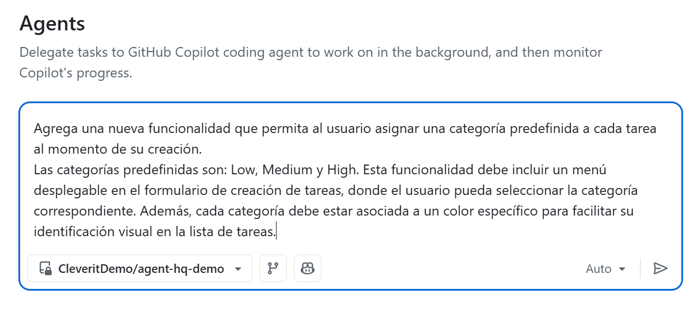
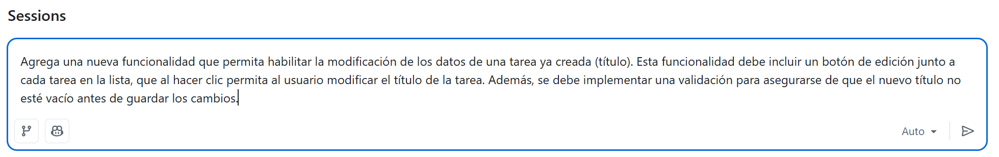
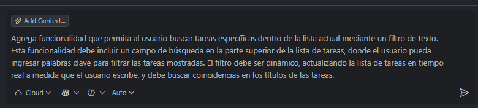

<div align="center">
  

  # Sesión Sobre Capacidades Agénticas de GitHub Copilot

  [](https://github.com/features/copilot)
  [](https://nodejs.org/)
  [](https://reactjs.org/)
  [](https://www.docker.com/)
</div>

---

**Esta capacitación** práctica te ayudará a familiarizarte con las potentes herramientas agénticas de GitHub, tales como: **Copilot Coding Agent**, **Custom Agents**, **Agent Skills**, **Mission Control** y **GitHub Copilot Code Review**; además, cubriremos espacios de documentación personalizados utilizando **GitHub Copilot Spaces**.

> Para obtener más información sobre estas herramientas, consulta la documentación oficial:
>
> - [Coding Agent](https://docs.github.com/en/enterprise-cloud@latest/copilot/how-tos/use-copilot-agents/coding-agent)
> - [Custom Agents](https://docs.github.com/en/copilot/concepts/agents/coding-agent/about-custom-agents)
> - [Agent Skills](https://docs.github.com/en/copilot/concepts/agents/about-agent-skills)
> - [Extend Copilot Chat with MCP](https://docs.github.com/en/copilot/how-tos/provide-context/use-mcp/extend-copilot-chat-with-mcp)
> - [Mission Control](https://github.blog/changelog/2025-10-28-a-mission-control-to-assign-steer-and-track-copilot-coding-agent-tasks/?utm_source=blog-day1-recap-mission-control-cta&utm_medium=blog&utm_campaign=universe25)
> - [Copilot Spaces](https://docs.github.com/en/copilot/how-tos/provide-context/use-copilot-spaces)
> - [Code Review](https://docs.github.com/en/copilot/how-tos/use-copilot-agents/request-a-code-review)

---

## 📋 Tabla de Contenidos

1. [🚀 Ejecutar la aplicación](#-ejecutar-la-aplicación)
2. [🧠 Paso 1. Uso de Copilot Coding Agent (Parte 1)](#-paso-1-uso-de-copilot-coding-agent-parte-1)
    - [Desde un Issue](#1-desde-un-issue-📝)
    - [Desde Mission Control](#2-desde-mission-control-🎛️)
    - [Desde la pestaña Agents](#3-pestaña-agents-en-el-repositorio-📂)
    - [Delegando desde el IDE](#4-delegando-desde-el-ide-💻)
3. [🤖 Agentes personalizados](#-agentes-personalizados)
4. [🛠️ Agent Skills](#️-agent-skills)
5. [🪐 Paso 2. Uso de GitHub Copilot Spaces](#-paso-2-uso-de-github-copilot-spaces)
6. [🧠 Paso 3. Uso de GitHub Copilot Coding Agent (Parte 2)](#-paso-3-uso-de-github-copilot-coding-agent-parte-2)
7. [👀 Paso 4. GitHub Copilot Code Review](#-paso-4-github-copilot-code-review)

---

## 🚀 Ejecutar la aplicación

Para poner en marcha esta aplicación tienes dos opciones disponibles:

1.  **Ejecución Manual:** Consulta la página [about](./about.md), donde encontrarás los pasos y requisitos necesarios para ejecutar esta aplicación localmente paso a paso.
2.  **Asistencia de Copilot Agent:** Puedes solicitarle al agente que se encargue de la ejecución. Abre el chat en tu editor en modo agente y utiliza un prompt como el siguiente:

    > "Analiza la estructura del proyecto y ejecuta los comandos necesarios para levantar la aplicación utilizando Docker Compose."

Esta es una aplicación de **Lista de Tareas (Todo-List)** que se ejecuta utilizando Docker Compose. Consta de dos servicios:
- **Frontend**: Construido con React.
- **Backend**: Construido con Node.js y Express.


---

## 🧠 Paso 1. Uso de Copilot Coding Agent (Parte 1)

El objetivo es **cambiar los colores de acento** de la aplicación Todo-List.

**Estado Actual:**


**Objetivo:** Cambiar el color de acento azul a **verde oscuro**.

### Métodos para solicitar cambios al Copilot Coding Agent:

### 1. Desde un Issue 📝
Esta es la forma más estructurada. Asignas un issue a Copilot y este se encarga del resto. **Este es el método que utilizaremos a continuación.**

### 2. Desde Mission Control 🎛️
Accede a [github.com/copilot/agents](https://github.com/copilot/agents) para gestionar sesiones de agentes a nivel global.

### 3. Pestaña "Agents" en el Repositorio 📂
Inicia nuevas tareas específicas para este repositorio sin crear un issue formal desde la pestaña **Agents**.

### 4. Delegando desde el IDE 💻
Pide a Copilot directamente en VS Code o Visual Studio que realice tareas complejas.

---

### **Asignar un Issue a Copilot**

1. Ve a la pestaña de **Issues** en este repositorio.

   

2. Haz clic en **New Issue**.
3. Completa el **Título** con la acción precisa:

   ```text
   Modifica los colores de acento en cada uno de los componentes de la aplicación; el color actual es azul, cámbialo de azul a verde oscuro.
   ```

4. Completa la **Descripción** con contexto adicional:

   ```text
   Por favor, ten en cuenta que todos los cambios deben realizarse para ambos aspectos de la aplicación: modo oscuro y modo claro.
   ```

   **Ejemplo:**
   

5. En el panel lateral derecho, asigna el issue a **GitHub Copilot**.

   

6.  Haz clic en **Submit New Issue**.

> [!NOTE]
> Copilot abrirá un nuevo Pull Request (Draft), lo marcará como **Trabajo en Progreso (WIP)** y comenzará a analizar la tarea. Observa el emoji 👀 indicando que Copilot está trabajando.


---

### **Asignar mediante Mission Control**

1. Ve a [github.com/copilot/agents](https://github.com/copilot/agents).
2. Selecciona el repositorio, la rama y el agente (Copilot).
3. Utiliza el siguiente prompt:

   ```text
   Agrega una nueva funcionalidad que permita al usuario asignar una categoría predefinida a cada tarea al momento de su creación.
   Las categorías predefinidas son: Low, Medium y High. Esta funcionalidad debe incluir un menú desplegable en el formulario de creación de tareas, donde el usuario pueda seleccionar la categoría correspondiente. Además, cada categoría debe estar asociada a un color específico para facilitar su identificación visual en la lista de tareas.
   ```

4. Haz clic en asignar.

   

---

### **Asignar desde la pestaña "Agents" del repositorio**

1. Ve a la pestaña **Agents** en tu repositorio.
2. Crea una nueva tarea con el siguiente prompt:

   ```text
   Agrega una nueva funcionalidad que permita habilitar la modificación de los datos de una tarea ya creada (título). Esta funcionalidad debe incluir un botón de edición junto a cada tarea en la lista, que al hacer clic permita al usuario modificar el título de la tarea. Además, se debe implementar una validación para asegurarse de que el nuevo título no esté vacío antes de guardar los cambios.
   ```

   

---

### 🕵️‍♂️ Supervisión e Intervención en Tiempo Real

Tanto en Mission Control como en la pestaña Agents, tienes control total:

*   **Registro de Sesiones:** Ve en tiempo real las acciones y comandos.
*   **Intervención Humana:** Intervén en cualquier momento para dar instrucciones o detener al agente.

---

### Delegando desde el IDE

En **VS Code**, selecciona "cloud" en el chat de Copilot y usa este prompt:

```text
Agrega funcionalidad que permita al usuario buscar tareas específicas dentro de la lista actual mediante un filtro de texto. Esta funcionalidad debe incluir un campo de búsqueda en la parte superior de la lista de tareas, donde el usuario pueda ingresar palabras clave para filtrar las tareas mostradas. El filtro debe ser dinámico, actualizando la lista de tareas en tiempo real a medida que el usuario escribe, y debe buscar coincidencias en los títulos de las tareas.
```



---

## 🤖 Agentes personalizados

GitHub Copilot permite crear agentes con habilidades específicas para tu proyecto.

- **¿Qué son?** Versiones del Agente de Código adaptadas a tus estándares.
- **Rol:** Miembro del equipo experto en tus herramientas.
- **Eficiencia:** Configuración única, evita repetir contexto.

### Creación de un Agente Personalizado (Nivel Repositorio):

1. En Copilot Chat, selecciona **Configure Custom Agents...** > **Create new custom agent**.
2. **Scope:** Selecciona **Workspace** (se guarda en `.github/agents`).
3. **Nombre:** Asigna un nombre a tu agente.

Revisa la estructura en `/agents`. Copia el agente de ejemplo a `.github/agents` para probarlo. 

**Prompt de ejemplo:**
Debes seleccionar el agente personalizado en el selector de agentes antes de enviar la siguiente instrucción:

```text
Migra el frontend actual (Vanilla JS) a React con Vite y actualiza la configuración de Docker.

Tareas de Código:
1. Refactoriza `frontend/index.html` y `frontend/script.js` en componentes de React (`App`, `TaskList`, `TaskForm`, etc.).
2. Implementa la gestión de estado con Hooks para replicar la funcionalidad CRUD actual.
3. Reutiliza `frontend/style.css` para mantener el diseño.
4. Genera la configuración de Vite (`vite.config.js`).

Tareas de Infraestructura (Docker):
1. Actualiza `frontend/Dockerfile` para usar una construcción "multi-stage":
   - Etapa 1 (Build): Usa una imagen de Node para instalar dependencias y ejecutar `npm run build`.
   - Etapa 2 (Serve): Usa una imagen de Nginx para servir los archivos estáticos generados en la carpeta `dist`.
```

---

## 🛠️ Agent Skills

Módulos especializados que Copilot activa para resolver tareas complejas.

- **Ubicaciones:** `.github/skills/` (repositorio) o `~/.copilot/skills/` (global).
- **Archivo:** `SKILL.md` con encabezado YAML e instrucciones.

**Ejercicio:**
Revisa la carpeta `skills` en la raíz del proyecto. Contiene un skill de ejemplo sobre github issues. Una vez revisado, mueve la carpeta `skills` a `.github/skills/`.

**Nota**: En este punto, estaremos usando el MCP server de GitHub para poder crear un issue en GitHub directamente desde el agente personalizado utilizando la habilidad `github-issues`. Para esto, asegúrate de tener configurado el MCP server y de que tu agente personalizado tenga acceso a esta habilidad. Es posible que se solicite iniciar sesión en GitHub para autenticar y poder usar el MCP server.

usa este prompt en VS Code:

```text
Crea un issue en github que me permita agregar una funcionalidad para ver una card o un texto con la cantidad de tareas pendientes 
```

El modo agente detectará la intención de crear un issue y activará la habilidad `github-issues` para ejecutar esta tarea. Verás que el agente genera el issue automáticamente con la estructura y formato adecuado.

---

## 🪐 Paso 2. Uso de GitHub Copilot Spaces

Copilot Spaces centraliza el contexto y documentación para tu equipo.

### 2.1 Crear documentación

1. Crea una rama: `git checkout -b copilot-spaces-branch`
2. En Copilot Chat (VS Code), usa el prompt:

   ```text
   Mejora el archivo #about.md para incluir documentación avanzada del proyecto. Incluye secciones que indiquen: cuáles son los runtimes y frameworks utilizados, explica detalladamente cómo ejecutar el proyecto y cómo acceder a él a través del navegador. 🌐

   Utiliza un lenguaje técnico orientado a un público objetivo de Desarrolladores, Sysadmins, Ingenieros DevOps e Ingenieros Cloud. 🛠️☁️

   Incluye emojis e iconos cuando sea necesario. ✨
   ```

3. Acepta los cambios, haz commit y push.

### 2.2 Creación de un entorno de Copilot Spaces

1. Ve a [GitHub](https://github.com) > Menú lateral > **Copilot** > **Spaces**.
2. Haz clic en **Create space** y completa los datos.
3. Agrega el repositorio como fuente.
4. Pregunta al espacio:

   ```text
   ¿Cómo puedo ejecutar este proyecto y cuáles son los entornos de ejecución (runtimes) de copilot-agentic-demo?
   ```

---

## 🧠 Paso 3. Uso de GitHub Copilot Coding Agent (Parte 2)

Verifica las tareas asignadas anteriormente a través de los diferentes métodos (Issue, Mission Control, Agents Tab, IDE).

1. Abre los Pull Requests asociados a cada una de las tareas.
2. Revisa los detalles y capturas de pantalla proporcionados por Copilot.
3. Haz clic en **View Session** para ver el "paso a paso" del agente y la estrategia utilizada.
4. Si estás conforme con los resultados, haz Merge de los PRs.


<div align="center">

Si descargaste el proyecto y ejecutaste la aplicación, este es el resultado final después de que Copilot Coding Agent realizó los cambios solicitados en el Paso 1.


</div>


---

## 👀 Paso 4. GitHub Copilot Code Review

Automatiza la revisión de código en el flujo SDLC.

1. Ve a un Pull Request abierto.
2. Asigna la revisión a **GitHub Copilot**.


Copilot dejará comentarios y sugerencias automáticamente.

---

**¡Has llegado al final de la capacitación. Felicidades! 💫**
