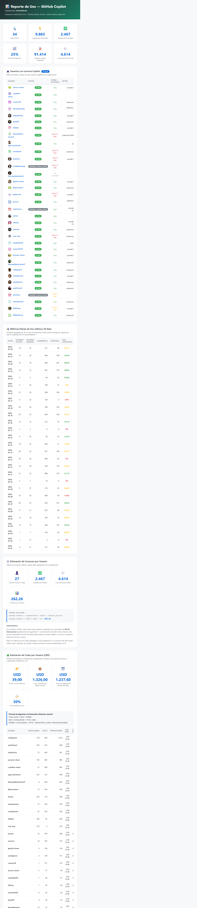
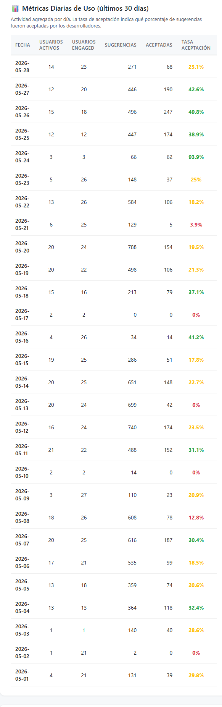
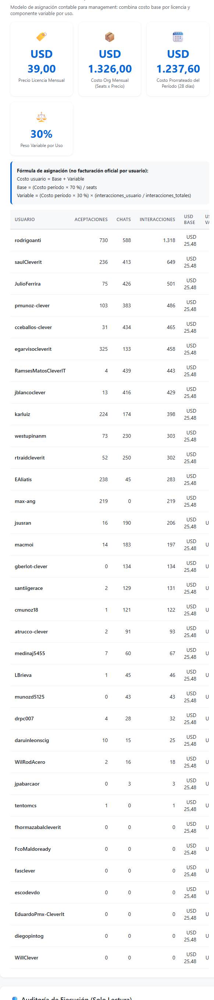
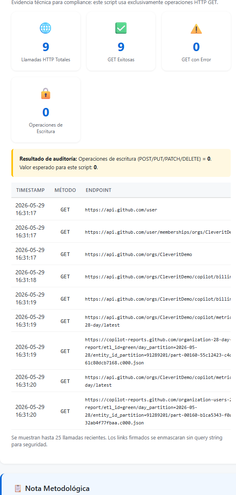

# Executive Guide (EN-US)
## GitHub Copilot Enterprise report (USD per user)

This document explains, in manager-friendly language, how to run the script, what each parameter does, how the USD user-cost estimate is calculated, and how to read each section of the generated HTML report.

---

## 1) How to run the script

Base command:

```powershell
.\copilot-report.ps1 -Org CleveritDemo -PromptToken
```

The script will:
- Prompt for the token in hidden input
- Generate `copilot-report.html`
- Open the report automatically in your browser

---

## 2) Configurable parameters

```powershell
.\copilot-report.ps1 \
  -Org CleveritDemo \
  -PromptToken \
  -SeatPriceUsd 39 \
  -VariableCostWeight 0.30 \
  -BillingDaysPerMonth 30
```

### Parameter reference

- `-Org`
  - GitHub organization to query.
  - Example: `CleveritDemo`

- `-PromptToken`
  - Prompts for token securely (not shown in terminal output).

- `-Token`
  - Passes token directly (less recommended than `-PromptToken`).

- `-SeatPriceUsd`
  - Monthly Copilot Enterprise seat price in USD.
  - Example: `39`

- `-VariableCostWeight`
  - Weight of the usage-based component, from `0` to `1`.
  - Example: `0.30` means 30% variable and 70% fixed.

- `-BillingDaysPerMonth`
  - Day basis used for monthly proration.
  - Example: `30`

---

## 3) What parameters are used for (examples)

### Scenario A: conservative allocation (more equal)

```powershell
.\copilot-report.ps1 -Org CleveritDemo -PromptToken -SeatPriceUsd 39 -VariableCostWeight 0.10 -BillingDaysPerMonth 30
```

Interpretation:
- 90% of cost is allocated equally by seat.
- 10% is allocated by usage.

### Scenario B: balanced allocation

```powershell
.\copilot-report.ps1 -Org CleveritDemo -PromptToken -SeatPriceUsd 39 -VariableCostWeight 0.30 -BillingDaysPerMonth 30
```

Interpretation:
- 70% fixed by seat.
- 30% variable by usage.

### Scenario C: usage-sensitive allocation

```powershell
.\copilot-report.ps1 -Org CleveritDemo -PromptToken -SeatPriceUsd 39 -VariableCostWeight 0.50 -BillingDaysPerMonth 30
```

Interpretation:
- 50% fixed by seat.
- 50% variable based on activity.

---

## 4) Formula used for user cost estimation (USD)

The script applies an internal accounting allocation model (showback), because GitHub billing is seat-based and does not publish an official exact USD amount per individual user.

### Step 1: organization cost for the period

- `Org monthly cost = seats * SeatPriceUsd`
- `Period cost = Org monthly cost * (period_days / BillingDaysPerMonth)`

### Step 2: split fixed + variable pools

- `Base pool = Period cost * (1 - VariableCostWeight)`
- `Variable pool = Period cost * VariableCostWeight`

### Step 3: user-level allocation

- `User base USD = Base pool / total_seats`
- `User interactions = acceptances + chats`
- `User variable USD = Variable pool * (user_interactions / total_interactions)`
- `User estimated USD = User base USD + User variable USD`

Important management note:
- This is **not** GitHub's official per-user invoice value.
- It is a transparent internal cost-allocation model for financial governance.

---

## 5) How to read the generated HTML report

### Full report view



### Section: main KPIs

Shows period-wide totals:
- Active seats
- Suggestions generated
- Suggestions accepted
- Acceptance rate
- Accepted lines
- Chats

Management value: top-level adoption and effectiveness signal.

### Section: licensed users

Lists seat holders and recent activity.

Management value: license coverage and low-usage seat detection.

### Section: daily metrics



Shows daily trend (when usage-report data is available).

Management value: identify adoption spikes and drops over time.

### Section: estimated user consumption

Shows interaction intensity per active user.

Management value: operational signal for engagement depth.

### Section: estimated user cost (USD)



Explains model and provides per-user table with:
- Acceptances
- Chats
- Interactions
- Base USD
- Variable USD
- Estimated total USD

Management value: internal cost distribution for departments/teams/users.

### Section: execution audit (read-only)



Compliance evidence:
- Total HTTP calls
- Success/failure counts
- Write operations count (must be 0)

Management value: confirms script is read-only and does not modify org settings or data.

---

## 6) Executive recommendation

For monthly governance reporting, start with `VariableCostWeight = 0.30` as the standard policy and keep it stable over time for comparability.

If finance wants simpler allocation:
- use `0.00` (100% equal per seat)

If finance wants stronger usage accountability:
- use `0.50` (half fixed, half usage-based)
